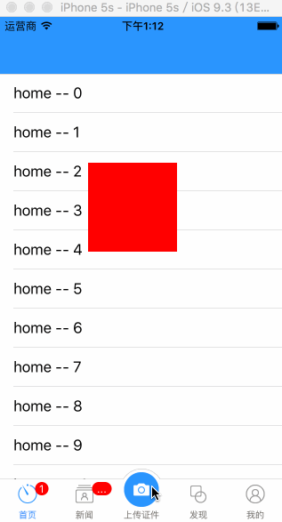
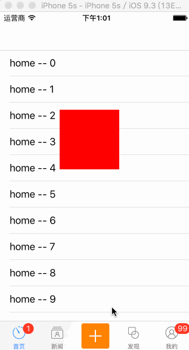
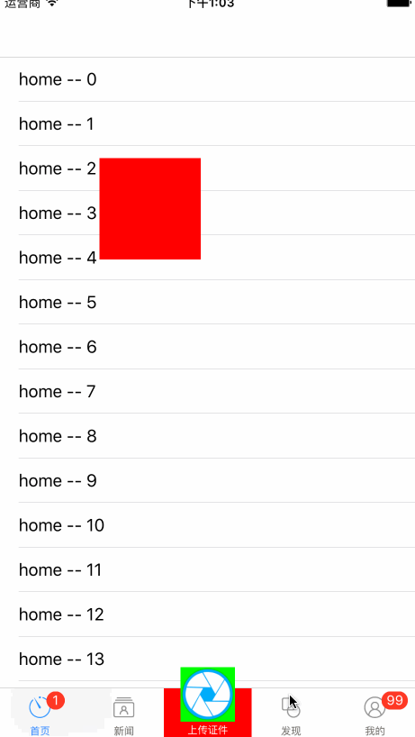
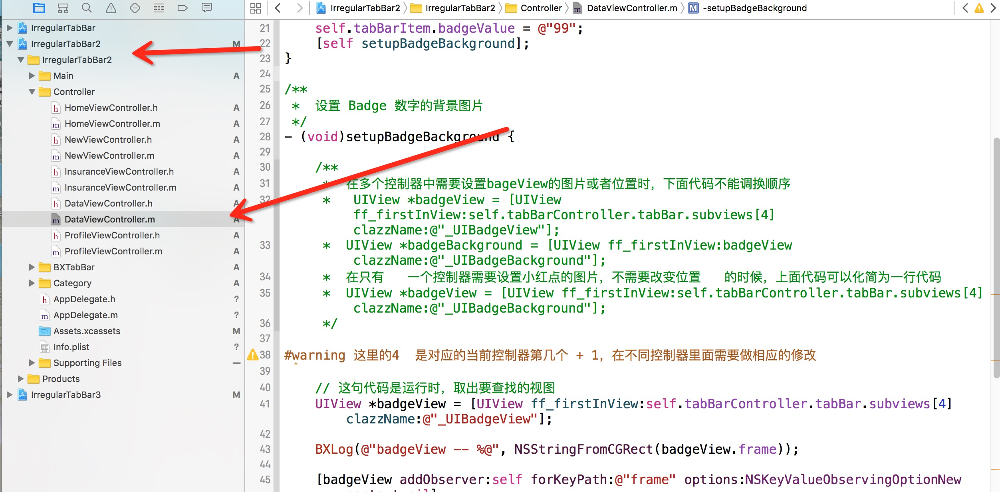
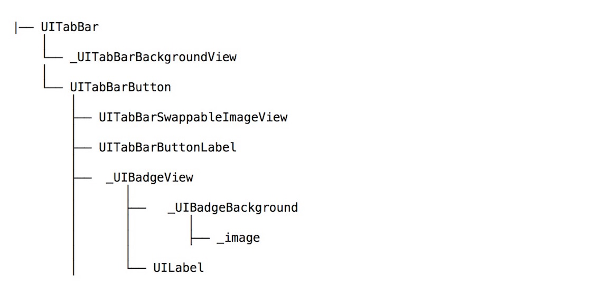

# IrregularTabBar
  引用这https://github.com/jiangyongjian/IrregularTabBar
  自己
  备份一份

# GIF
  



### 请大家主要小红点的细节，截图

 

详细教学，请看IrregularTabBar2工程里面的



## 工程结构
做下说明：请用IrregularTabBar.xcworkspace打开


 ```

├── IrregularTabBar     #请用IrregularTabBar.xcworkspace打开

|── IrregularTabBar     #第一个项目，完全自定义tabBar，但跟系统用法一样
        ├── Main        #导航控制器，tabBarController
          
└── IrregularTabBar2   #第二个项目，自定义继承系统UITabBar跟系统用法一样
        ├── Main        #导航控制器，tabBarController 
               
└── IrregularTabBar3    #第三个项目，不用自定义，完全用系统的
        ├── Main        #导航控制器，tabBarController

 ```  
  
 
## 详解UITabBar结构



# Usage
 `IrregularTabBar` 很简单，就想到与你创建工程，只要修改一下控制器的名字，跟换一下图片就OK了。
 
 里面的Category是自己开发中常用和收集的分类，功能都非常强大。
 
 拖出项目，修改项目名, 跟换图片，可以直接开发，代码完全融入你项目，跟自己开发的一模一样

IrregularTabBar 自定义tabBar，但用法跟系统完全一样.

```
self.tabBarItem.badgeValue = @"1";

self.tabBarController.selectedIndex = 4;

```

IrregularTabBar2 自定义继承系统UITabBar跟系统用法一样. 

```
self.tabBarItem.badgeValue = @"1";

self.tabBarController.selectedIndex = 4;

UIView *badgeView = [UIView ff_firstInView:self.tabBarController.tabBar.subviews[4] clazzName:@"_UIBadgeView"];
        
[badgeView setValue:[NSValue valueWithCGRect:CGRectMake(-100, -100, 40, 18)] forKey:@"frame"];

 if ([[[UIDevice currentDevice] systemVersion] floatValue] >= 10.0) { // 注意iOS 10以后系统改变了结构
        UIView *badgeBackgroundUIImageView = [UIView ff_firstInView:badgeView clazzName:@"UIImageView"];
        UIImageView *cirleUIImageView = (UIImageView *)badgeBackgroundUIImageView;
        cirleUIImageView.image = [UIImage resizedImage:@"m_badge"];
    } else {

		UIView *badgeBackground = [UIView ff_firstInView:self.tabBarController.tabBar.subviews[4] clazzName:@"_UIBadgeBackground"];
		
		[badgeBackground setValue:[UIImage imageNamed:@"m_badge"] forKey:@"_image"];
	}
```

IrregularTabBar3 完全使用系统tabBar，用法和上面一样，需要看项目给出的警告.

# 联系我
 QQ 453255376, 希望大家踊跃联系我，把程序写的更好。有更好的想法，有不明白的问我。以后tabBar想怎么搞就怎么搞，搞到它怀孕为止。喜欢的点个星星。
 
